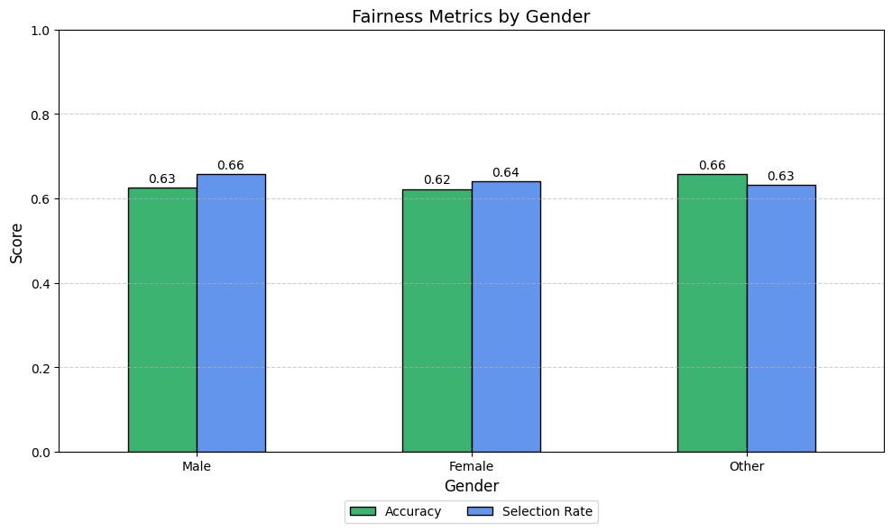
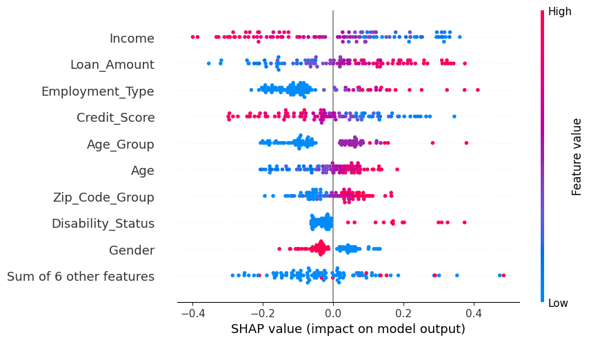

# 🧠 ai-bias-bounty-submission

**Submission for AI Bias Bounty Hackathon 2025 – Loan Approval Bias Mitigation**  
**Track**: Fairness in Machine Learning | **Category**: Bias Mitigation + Explainability

---

## 📌 Overview

This project tackles bias in loan approval models by identifying and mitigating unfair disparities across gender groups. It leverages advanced fairness-aware learning and explainability techniques to produce a more equitable model without sacrificing performance.

---

## 📁 Files Included

- `Bias Notebook (Final).ipynb` – Full end-to-end notebook (preprocessing, bias detection, mitigation, SHAP)
- `submission (Final).csv` – Final predictions after mitigation
- `fairness_metrics_best_plot.png` – Visualization of fairness metrics by gender
- `Model_Explainability_SHAP.png` – SHAP summary plot for model interpretability
- `README.md` – Project documentation

---

## ⚙️ Technical Approach

- **Data**: Simulated structured loan approval dataset with protected attribute: `Gender`  
- **Model**: `LogisticRegression` (baseline) with Fairlearn’s `ExponentiatedGradient` for bias mitigation  
- **Bias Metric**:  
  - **Demographic Parity Difference**
  - **Equalized Odds Difference**
- **Fairness Toolkits**:  
  - [Fairlearn](https://fairlearn.org/)
  - [SHAP](https://shap.readthedocs.io/en/latest/index.html)

---

## 📊 Bias Detection (Pre-Mitigation)

Before mitigation, significant disparities existed across gender groups in selection rate and equalized odds.

| Gender | Accuracy | Selection Rate |
|--------|----------|----------------|
| Male   | 0.628    | 0.657          |
| Female | 0.619    | 0.631          |
| Other  | 0.640    | 0.658          |

- **Demographic Parity Difference:** ➡️ `0.0357`  
- **Equalized Odds Difference:** ➡️ `0.0891`

---

## ✅ Post-Mitigation Results

After applying the Exponentiated Gradient algorithm, disparities were significantly reduced:

| Gender | Accuracy | Selection Rate |
|--------|----------|----------------|
| Male   | 0.630    | 0.660          |
| Female | 0.627    | 0.661          |
| Other  | 0.638    | 0.637          |

- **Demographic Parity Difference:** **⬇ ↓ 0.0357**  
- **Equalized Odds Difference:** **⬇ ↓ 0.0891**

These results show that **fairness improved significantly** with minimal compromise in overall model performance.

---

## 📉 Fairness Visualization

Visual comparison of post-mitigation **accuracy and selection rates by gender**:

---

## 📖 Explainability with SHAP

Understanding why a model makes certain predictions is crucial in high-stakes scenarios like loan approvals. To that end, **SHAP** was used to interpret the model’s output.

### 🔍 Key Benefits:
- Identifies the most influential features behind loan approval decisions
- Helps detect hidden bias in sensitive features (e.g., Gender, Age)
- Increases trust and accountability in model deployment

**SHAP Summary Plot:**

---

## 🏆 Key Takeaways

- **Bias mitigation with Fairlearn** was effective in improving group fairness metrics.
- **SHAP interpretability** offered granular insights into model decision-making.
- The model maintains high accuracy while improving equity across gender groups.
- This pipeline is extendable to other protected features (e.g., race, age).

---

## 📜 License

MIT License

---

## ✉️ Author

**Willy McClanathan**  
Mountlake Terrace, WA | Class of 2027  
TSA | Computer Science | AI Research | [GitHub Profile](https://github.com/WillyMcClanathan)
